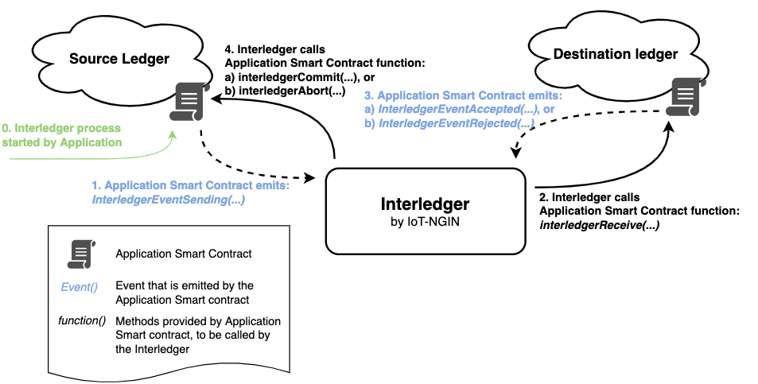
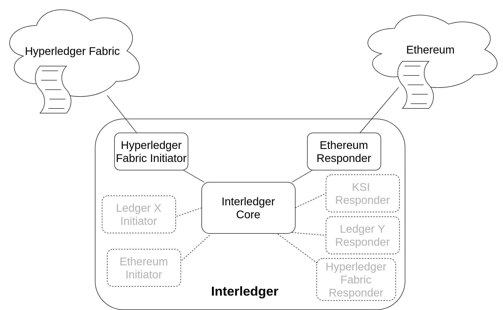

# Decentralised Interledger Bridge (DIB) 2.0

## Table of Contents
- [Description](#description)
  * [Architecture Overview](#architecture-overview)
  * [Key Technologies](#key-technologies)
- [Usage](#usage)
  * [Prerequisites](#prerequisites)
  * [Client Ledgers](#client-ledgers)
  * [DIB](#dib)
  * [Docker](#docker)
  * [Configuration](#configuration)
- [Testing](#testing)
  * [Prerequisites for Testing](#prerequisites-for-testing)
  * [Running the Tests](#running-the-tests)
  * [Evaluating the Results](#evaluating-the-results)
  * [Test for multi-ledgers-transaction](#test-for-multi-ledgers-transaction)
- [Generating Documentation](#generating-documentation)
  * [Requirements](#requirements)
  * [Generation](#generation)
  * [Miscs](#miscs)
- [Open Issues](#open-issues)
- [Future Work](#future-work)
- [Release Notes](#release-notes)
- [Contact Information](#contact-information)
- [License](#license)

## Description

The Decentralized Interledger Bridge (DIB) enables *atomic general-purpose data transfers between distributed ledgers* without requiring any changes to the ledgers themselves. In practice, the Interledger component enables activity on an *Source* ledger to trigger activity on a *Destination* ledger in an atomic manner. The ledgers can be of the same or different types (e.g. Ethereum, Hyperledger Fabric, Hyperledger Indy, or KSI), and once triggered, Interledger passes a customisable payload from the Source ledger to the Destination ledger(s). DIB is a decentralised version of the Flexible Interledger Bridge (FIB) in the [SOFIE Framework](https://github.com/SOFIE-project/Framework).

The distributed applications utilising the DIB can utilise the payload functionality to implement any customised features. Examples of how Interledger can be utilised include:
- [Transfering Data](/doc/example-data_transfer.rst) from one ledger to another.
- [Storing Data Hashes](/doc/adapter-ksi.md) stores detailed information in a (private) ledger and a hash of the information is then  stored in a (more trustworthy but also more expensive public) ledger at suitable intervals using Interledger to benefit from the higher trust of a public ledger.
- [Game Asset Transfer](/doc/example-game_asset_transfer.rst) implements a state transfer protocol, which is used for managing in-game assets: the assets can either be used in a game or traded between gamers. For both activities, a separate ledger is used and Interledger ensures that each asset is active in only one of the ledgers at any moment.
- [Hash Time Locked Contracts (HTLCs)](/doc/example-HTLC.md) describes how to use the Interledger to automate the asset exchange between two ledgers using Hash Time-Locked Contracs (HTLCs).
- [Automated Responsible Disclosure of Security Vulnerabilities](https://ieeexplore.ieee.org/document/9606687) publication describes how the Interledger can be utilised in automating the disclosure of security vulnerabilities in a secure and transparent manner.

### Architecture Overview
The basic service offered by the DIB is a *DIB Connection*, which links an endpoin on the Source ledger to an endpoint on the Destination ledger. The endpoints are typically smart contracts, which are part of the application utilising the interledger. Each connection is unidirectional, but if the endpoints want to send data in both directions, this can be accomplished by opening two connections in opposite directions between the same endpoints.

Whenever the Source endpoint wants to send data, it triggers a transfer (e.g. on Ethereum this is done by emitting an event), after which the DIB component will pass the data to the Destination endpoint. The Destination endpoint will then have to either acknowledge it successfully received the data or refuse the transfer if the application e.g. finds the date invalid. This reply is then returned to the Source endpoint by the DIB component to conclude the transfer so that both endpoints have the same knowledge of the transfer.

The DIB implements this service by running 1-N identical *DIB Nodes*, which together form one *DIB Bridge*. A Bridge can support as many Connections as the underlying hardware is capable of, and as each node participates in every Connection, having more Nodes in a Bridge improves the throughput and resiliency of the that Bridge, and if the Nodes are also run by multiple parties in a consortium (rather than a single party), this also increses the trustworthiness of the Bridge as the parties will monitor each other's actions.

Finally, each Bridge is completely independent, so an unlimited number of Bridges can be run by any party or consortium.

#### Adaptive design


*Figure 1: How DIB implemnts a Connection*

On some ledgers (e.g. Ethereum and Hyperledger Fabric), the endpoint is an application smart contract on the ledger (the smart contract has to implement the *Initiator* and/or the *Responder* [interface](/doc/Interledger_internals.rst#ledger-interfaces)), while on others (e.g. Hyperledger Indy and KSI), no smart contract is required (or even available) and the Interledger communicates with the ledger directly. The ability to act as the Initiator and/or the Responder is normally included in the smart contract implementing the application logic, but separate proxy contracts can also be used as wrappers to interface with the Interledger component as has been done e.g. in the [Food Supply Chain pilot](https://media.voog.com/0000/0042/0957/files/sofie-onepager-food_final.pdf) (see the pilot's [smart contracts](https://github.com/orgs/SOFIE-project/projects/1) for details).

As shown in figure 1, when DIB is configured to provide a *DIB Connection* between two Ethereum endpoints,it listens for events (*InterledgerEventSending*) from the *Source endpoint*, which triggers the Bridge to call the *interledgerReceive()* function of the *Destination endpoint*. Once the *Destination endpoint* is finishied processing the transaction, it emits either *InterledgerEventAccepted* event, which triggers the Interledger to call *interledgerCommit()* function of the *Source endpoint*, or the *InterledgerEventRejected* event, which triggers the Interledger to call the *interledgerAbort()* function of the *Source endpoint*.

The *id* parameter of *InterledgerEventSending* is only for the *Source endpoint's* internal use: each transaction can have a unique *id* or multiple transactions can share the same *id* depending on the needs of the application smart contract. However, the *id* is not passed to the *Destination endpoint*, only the *data* parameter is (so if the *Initiator* wishes to send the *id* also to the Responder, it has to  be included in the *data* parameter). Internally, the Interledger component processes each transaction individually, so each transaction is given a unique *nonce*, which is used in all activities with the *Destination endpoint*. Finally, when the success/failure of the transaction is communicated back to the *Source endpoint*, the nonce is mapped back to the original *id*.

Internally, as shown in Figure 2, the Interledger component is composed of two types of elements:
- a single *core*  that manages the transactions between ledgers. It passes the transactions from the *Initiator adapter* to the correct *Responder adapter(s)* and the corresponding success/fail statuses back to the *Initiator adapter* but does no processing on the data payload.
- *DLT adapters (Initiators and Responders)* links the core with the different ledger types. The adapter is responsible for translating between the core and the ledger's native commands (listening for events and calling functions). Normally, the adapter does no processing on the data payload, but it is possible to implement adapters with specific processing functionality, if the ledger itself lacks suitable functionality (e.g. the KSI Responder Adapter calculates a hash of the data payload and stores the hash to the KSI ledger as KSI only supports storing hashes).



*Figure 2: internal structure of the DIB*

DIB currently supports four DLT types: [Ethereum](/doc/adapter-eth.md), [Hyperledger Fabric](/doc/adapter-fabric.md), [Hyperledger Indy](/doc/adapter-indy.md) and [KSI](/doc/adapter-ksi.md). For Ethereum and Hyperledger Fabric, both an *Initiator adapter* and a *Responder adapter* are provided, while for Hyperledger Indy, only a *Initiator adapter* is provided, and for KSI only a *Responder adapter*. Other DLTs can be supported by [implementing adapters](/doc/Interledger_internals.rst#extending-interledger-to-support-additional-ledgers) for them. Support for additional ledgers is [Future Work](#Future-Work).

More details of the Interledger component's implementation  can be found in the [Technical description](/doc/Interledger_internals.rst).


### Key Technologies
The software modules are implemented in **Python**.
Currently the component supports the Ethereum ledger, and thus **Solidity** smart contracts, Hyperledger Fabric, as well as the KSI ledger.

***

## Usage

The `src/interledger` directory contains the code implementing the software modules of the DIB and the default adapters for Ethereum and Hyperledger Fabric.

The `ledgers/solidity/contracts` contains the smart contracts including the data transfer interfaces used by the DIB.

### Prerequisites

- Environment
	- **Python 3.8** (for software modules)
	- **Node.js 16** (older version of Node.js may work)
- A clone of this repository

### Client Ledgers

One DIB connection connects two client ledgers, and thus to run the DIB there needs to be client ledger(s) configured as source and destination endpoints. Typically, there would be one ledger as a source and another as a destination. However, it’s also possible to configure the same ledger to be the source and the destination at the same time, e.g. for testing purposes.

DIB supports different technologies such as Ethereum and Fabric as client ledgers. Further, different implementations of the technologies such as Geth (go-ethereum), a Go implementation of Ethereum, or Ganache can be used to set up client ledgers. However, these instructions describe how to set up two separate ledgers, one as a source and one as a destination, using Ganache.

#### 1) Installation

Install Ganache CLI

```bash
npm install ganache --global
```

Install dependencies for compiling and deploying the smart contract

```bash
cd ledgers/solidity/ && npm install
```

#### 2) Start

Start the ledgers by running following commands:

```bash
ganache-cli -p 7545 -b 1
ganache-cli -p 7546 -b 1
```

Using flag `-b 1` sets the block time to be one second as a simulation of mining.

#### 3) Deploy Smart Contracts

Finally, the smart contracts in the client ledgers, used as endpoints for the DIB, have to be compiled and deployed. There are basically three different approaches and they are organised as alternative options (a, b and c), the first one being the easiest and the last one providing the most control. If you are wondering which one to choose, pick the first option.

Running one of the following command sets also generates configuration files for the DIB nodes to the `config` directory, using the file `configs/dib.cfg` as the base template. The generated configuration files are following a naming convention where e.g. the second node of the first deployment is named as `dib-node-1-2.cfg`. In general, the first number after the prefix `dib-node` is the number of the deployment and the second number is the number of the node.

There is a separate configuration per each deployment and node combination, as each deployment has an individual smart contract address and each node has an individual minter address. Also, the node id is an incrementing value per each deployment.

To edit the base configuration, please check section [Configuration](#configuration)

##### (Option a) Compile & deploy smart contracts by running the following command:

```bash
make migrate-both
```

##### (Option b) Alternatively, if you prefer to migrate left and right network individually, you can use following commands (migrate-both is just a composite of these two commands):

```bash
make migrate-left
make migrate-right
```

##### (Option c) If you will, you can also run the migration commands manually that allows defining the number of nodes (N):

The number of DIB nodes is specified during the deployment of smart contracts, e.g. following commands deploy the GameToken contract(s):

```bash
cd ledgers/solidity

npx truffle migrate --reset --f 6 --to 6 --network left --nodes N --config_file ../../configs/dib.cfg

npx truffle migrate --reset --f 6 --to 6 --network right --nodes N --config_file ../../configs/dib.cfg
```

Here the `nodes` parameter denotes the number of DIB nodes. The `config_file` parameter denotes the base configuration file which is used by the deployment scripts, the scripts will create `config_file-node-1-1.cfg`, `config_file-node-1-2.cfg`, ..., etc. which then are used to launch the separate DIB instances.

### DIB

#### 1) Installation

```bash
python3 -m pip install setuptools-rust
python3 -m pip install .
```

#### 2) Running

Running one node

```bash
python3 start_dib.py configs/dib-node-1-1.cfg node.node_count=1
```

Running three nodes

```bash
python3 start_dib.py configs/dib-node-1-1.cfg node.node_count=3

python3 start_dib.py configs/dib-node-1-2.cfg node.node_count=3

python3 start_dib.py configs/dib-node-1-3.cfg node.node_count=3
```

It’s also possible to override settings in the configuration file with flags:

```bash
python3 start_dib.py configs/dib-node-1-1.cfg node.node_id=1 node.timeout_initial=3600
```

#### 3) Usage

##### a) Automated Runs (e.g. for tests and measurements)

Installation

```bash
pip install pytest pytest-asyncio
```

Run

```bash
python3 -m pytest -s tests/system/ethereum_multiple.py --config_file=configs/dib-node-1-1.cfg --transfers=1
```

`transfers` flag defines the number of transfers performed in the run.

##### b) Manual Run (CLI)

```bash
python3 demo/cli/cli.py configs/dib-node-1-1.cfg
```

In the shell:

```bash
mint 123 /toys/ ball123
state_of 123
transfer_out left 123
state_of 123
```

For more info, check: [CLI demo app](/demo/cli)

### Docker

On Macs with ARM-based silicon enter:
```bash
export DOCKER_DEFAULT_PLATFORM=linux/amd64
```

#### Build

To build a Docker image for a DIB node, execute following script:

```bash
sh scripts/docker-build-dib.sh
```

#### Run (a node)

Configuration file can be provided to the image at runtime with following command:

```bash
docker run -v /path/to/config.cfg:/var/interledger/configs/local-config.cfg interledger-dib
```

#### Run (shell)

Start shell:

```bash
sh scripts/docker-run-dib-shell.sh
```

...to e.g. run a node (or multiple nodes) with a following command:

```bash
python3 start_dib.py configs/dib-node-1-1.cfg node.node_count=1
```

...or CLI demo:

```bash
python3 demo/cli/cli.py configs/dib-node-1-1.cfg
```

For more info about how to use the CLI, check section [Manual Run (CLI)](#b-manual-run-cli) or [CLI demo](/demo/cli).

**Note!** If you are trying to connect resources such as ledgers on the host from the Docker container, use address/url `http://host.docker.internal` in the configuration. For more info about how to change the configuration, check section [Configuration](#configuration).

#### Description

`docker/Dockerfile` contains multiple build targets:
- **build**: only installs dependencies
- **run_demo**: runs Interledger command line demo
- **run_dib**: runs DIB Interledger component

`docker/Dockerfile.migrations` contains targets for compiling Ethereum smart contracts:
- **compose_migrations**: installs dependencies and compiles client smart contracts

#### Docker Compose

Docker Compose setup allows an easy usage of the Interledger [CLI demo](/demo/cli) by running following command:

```bash
sh scripts/compose_start_dib.sh
```

Note that starting the whole setup will take some time, especially for the first time when all the necessary Docker images are built, therefore it is important to allow the startup script to shutdown gracefully.

The setup contains two Ganache CLI instances that act as local ledgers, three DIB nodes, and the command line demo, see `docker-compose.yaml` for more details.

If there are any updates to the DIB component, example smart contracts, `Dockerfile`, or `docker-compose.yaml`, run `docker-compose -f docker-compose.yaml build` command to rebuild the containers.

### Configuration

The configuration file, following the `ini` format, has four main sections:

1) `[service]`: defines the connected ledgers, `left` and `right`, and the `direction` of the data transfer;
    - `direction` = `both` | `left-to-right` | `right-to-left`
    - `left` = *left*
    - `right` = *right*

2) `[left]`: indicates the `type` of that ledger and lists its options. The options depend on the specific ledger.
    - `type` = `ethereum` | `fabric` | ...
    - ...

3) `[right]`: same as above.
    - `type` = `ethereum` | `fabric` | ...
    - ...

3) `[node]`: general settings for the DIB node.
    - `node_id` = `1,2,...`
    - `secret` = a shared secret [string]
    - `timeout_initial` = initial timeout duration [integer]
    - `timeout_backoff` = timeout exponential backoff factor [positive number]
    - `timeout_disabled` = `true` / `false`
    - `confirm_transfer` = `true` / `false`
    - `verification_disabled` = `true` / `false`

The `direction` can have three values:
- `left-to-right` means that a single unidirectional *Interledger instance* is started so that it listens for events on the `left` ledger with the *Initator adapter* and transfers data to the `right` ledger with the *Responder adapter*;
- `right-to-left` the same, but with inverse order;
- `both` means that the two *Interledger instances* will be started in opposite directions to allow transfering data in both directions and that both *Initiator* and *Responder adapters* will be instantiated for both ledgers.

`left` and `right` are custom names and provide all the options needed to setup the ledgers. The available options depend on the `type` of the ledger, and more details of [Ethereum](/doc/adapter-eth.md) and [Hyperledger Fabric](/doc/adapter-fabric.md) configuration options are available in their respective documents. Finally, *left* and *right* can also be the same, so it is possible to use Interledger to connect smart contracts on the same ledger, which can be used e.g. in testing; in that case, section 3 can be omitted.

#### Configuration Example (for Ethereum Client Ledgers)

For ledger `type` =  `ethereum`, the required options are:

- **url:** the ethereum network url (localhost or with [Infura](https://infura.io/));
- **port:** if the url is localhost;
- **minter:** the contract minter (creator) address, which is also the account triggering the operations on a ledger;
- **contract:** the contract address;
- **contract_abi:** path to the file describing the contract ABI in JSON format.

The optional options include:
- **poa:** needs to be set to True if Geth proof-of-authority consensus is used
- **ipc_path:** path to the IPC pipe of the ledger running locally, e.g.: /home/user/geth/geth.ipc, this overrides url/port settings

As an example, there is the Interledger configuration file *config-file-name.cfg* for Ethereum, which defines two ledgers that are running locally on ports 7545 and 7546:

    [service]
    direction=both
    left=left
    right=right

    [left]
    type=ethereum
    url=http://localhost
    port=7545
    minter=0x63f7e0a227bCCD4701aB459b837446Ce61aaEb6D
    contract=0x50dc31410Cae2527b034233338B85872BE67EEe6
    contract_abi=ledgers/contracts/GameToken.abi.json

    [right]
    type=ethereum
    url=http://localhost
    port=7546
    minter=0xc4C13639a867EfA9f863aF99A4c8d002E57198e0
    contract=0xba83df5f1DF4aB344240eC9F1E096790c88A216A
    contract_abi=ledgers/solidity/contracts/GameToken.abi.json

	[node]
	node_id=1
	secret=thesecret
	timeout_initial=600
	timeout_backoff=2
	timeout_disabled=false
	confirm_transfer=true
	verification_disabled=false

For public Ethereum networks, external providers such as [Infura](https://infura.io/) can be utilised to avoid running a full Ethereum node. For external providers the additional option is:

- **private_key** the private key of the minter account used to sign the transaction;

Specifically, when using the Infura endpoints, please use the websocket version only so that the events emitted can be listened for properly. An example can be found in the `[infura]` part of the sample configuration `configs/local-config.cfg`.

***

## Testing

The `tests/` directory contains the scripts to test the software modules of the component, including unit tests, integration tests, and system tests, while the `ledgers/solidity/test/` directory contains the tests for the smart contracts.

### Prerequisites for Testing

The easiest way to run the tests for the component is by using [Tox](https://tox.readthedocs.io/en/latest/), which will install all dependencies for testing and run all the tests. It is also possible to run the tests directly using pytest, which also allows running tests independently.

Install Tox:

```bash
pip install tox
```

Or install pytest and dependencies:

```bash
pip install pytest pytest-asyncio
```

Some of the tests assume that local Ethereum networks are running. Ganache CLI tool can be used for this:

```bash
npm install -g ganache-cli
```

To run component tests requiring local Ethereum networks, and to test example smart contracts, install Truffle:

```bash
cd ledgers/solidity/
npm install
```

#### Environment

- [Truffle](https://www.trufflesuite.com/) to test the smart contracts (it includes the [Mocha](https://mochajs.org/) framework);
- The [pytest](https://docs.pytest.org/en/latest/getting-started.html) testing framework;
- The [pytest asyncio](https://github.com/pytest-dev/pytest-asyncio) library to test async co-routines.

### Running the Tests

#### Setup

First, local test networks (for the source and destination endpoints) need to be set up:

```bash
ganache-cli -p 7545 -b 1
ganache-cli -p 7546 -b 1
```

Here the block time is set to be one second as simulation of mining.

Afterwards, deploy the smart contracts to the local test networks:

```bash
make migrate-both
```

#### Run

Then, to test the component run:

```bash
tox
```

Read the [README](/tests/README.md) for pytest tests and test structure.

Note that testing the KSI support requires valid credentials for the Catena service. The tests can be run manually after adding credentials to `configs/local-config.cfg`:

```bash
pytest tests/system/test_ksi_responder.py
```

To test the smart contracts located in the `solidity` directory, shutdown `ganache-cli` instances (they will block the tests) and run the following (smart contracts are compiled automatically):

```bash
make test-contracts
```

#### Test DIB

**Start DIB nodes:**

One node:

```bash
python3 start_dib.py configs/dib-node-1-1.cfg node.node_count=1
```

Three nodes:

```bash
python3 start_dib.py configs/dib-node-1-1.cfg node.node_count=3

python3 start_dib.py configs/dib-node-1-2.cfg node.node_count=3

python3 start_dib.py configs/dib-node-1-3.cfg node.node_count=3
```

**Run Test**

```bash
python3 -m pytest -s tests/system/ethereum_multiple.py --config_file=configs/dib-node-1-1.cfg --transfers=10
```

`transfers` flag defines the number of transfers performed in the test.

### Evaluating the Results

When using Tox and Truffle, test results in JUnit format are stored in the `tests` directory.
Files `python_test_results.xml` and `smart_contracts_test_results.xml` contain results for
the Python and smart contracts' tests respectively.

### Test for multi-ledgers transaction

Integration tests for multi-ledgers mode have been included as well, with each step of the processing validated. It is not part of the default tests above, so to have to be run separately in the virtual envrionment with the following command:

```
python -m pytest --capture=sys tests/integration/test_interledger_multi.py
```

***

## Generating Documentation
A documentation file including the information provided by this readme and the docs for different modules and functions (both Python and Solidity) can be generated by using the [Sphinx](http://www.sphinx-doc.org/en/master/) tool. This section provides the commands to generate documentation in HTML and PDF formats.

### Requirements
- Install dependencies for generating documentation:
```bash
pip install 'sphinx<3.0.0' m2r sphinxcontrib-httpdomain sphinxcontrib-soliditydomain sphinxcontrib-seqdiag
```

- Solidity:
To generate code documentation for Solidity, install [soliditydomain](https://pypi.org/project/sphinxcontrib-soliditydomain/).

- PDF:
To generate documentation in PDF format, the `latexmk` package is required to be installed. Please follow the [instructions](http://www.sphinx-doc.org/en/master/usage/builders/index.html#sphinx.builders.latex.LaTeXBuilder). **warning! Does not work if Solidity files are included. Exlude them from the documentation if you want to generate PDF documentation.**

### Generation

- For HTML docs
```bash
make html
```

- For PDF docs via LaTeX
```bash
make latexpdf
```

In case a new sphinx documentation project is created:
- select **yes** when the `sphinx quickstart` command asks for `autodoc`;
- include the lines below in `doc/conf.py`:

```python
import sys
sys.path.insert(0, os.path.abspath('..'))

extensions = ['sphinx.ext.autodoc',
    'sphinxcontrib.soliditydomain',
    'sphinx.ext.coverage',
    ]

# autodoc lookup paths for solidity code
autodoc_lookup_path = '../ledgers/solidity/contracts' # or any other path to smart-contracts
```

***

## Open Issues

- DIB does not support having multiple ongoing DIB transfers with the same id. The id can be reused only after the transfer utilizing the same id was finalized.

- DIB supports currently only Ethereum ledgers for initiator and only Ethereum or KSI ledgers for responder. DIB doesn't support verifying transactions of other ledgers.

- Sometimes installing Node.js dependencies fails with a timeout error, this affects both the local installation and Docker compose setup. This seems to be a bug in npm: https://github.com/npm/cli/issues/3078 .

## Future Work

Some of the planned future improvements to the Interledger component include:


- Notification mechanism for Initiator and Responder ledgers for failed DIB transfers: if the DIB transfer fails for some reason, the client ledgers should be notified of this.

- Improving tests for DIB, including a Docker compose based setup for tests.

- Automated deployment of DIB instances based on new DSM Connection smart contract


***

## Release Notes

## Contact Information

**Contact**: Yki.Kortesniemi  at aalto.fi

**Contributors**: can be found in [authors](AUTHORS)


## License

This component is licensed under the Apache License 2.0.
