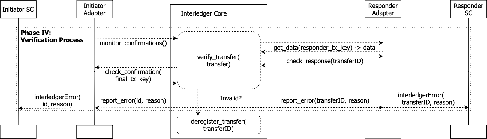

# Decentralized Interledger Bridge

## Motivation of DIB

One major limitation of the FIB design is centralization, meaning that the single node running the interledger bridge has to be trusted. Though FIB has been designed with post hoc auditability only. This is enough for applications where a single party is involved. However, for multiple parties to cooperate, shared trust is required in interledger transactions, ensuring that no one is misbehaving and undermines the interest of others.

This naturally leads to a decentralized architecture of the FIB design. Compared with its single node version, the decentralized architecture of FIB design should provide the shared trust among a consortium of participating parties for interledger transactions conducted, meanwhile improving the robustness of the interledger data transfer via redundancy.

To achieve a reasonable decentralized architecture for interledger, it is critical to make the following assumptions, that:
* Different parties form a consortium that run an application that involves interledger transactions, any party does not necessarily trust another
* Endpoints, which typically are smart contracts on distributed ledgers, at both source and destination of a data transfer will implement the interfaces required by FIB
* Interledger nodes controlled by different parties in a consortium have the same full access to the endpoints, including both read and write operations
* Interledger bridges at any nodes are equal in a sense, that there is no special or admin bridge with superior functionality or access

* Key concepts of the DIB architecture

| **Concept**           | **Description**                                                                                                                                                                          |
|-----------------------|------------------------------------------------------------------------------------------------------------------------------------------------------------------------------------------|
| *Interledger Bridge*  | The digital service that facilitates the interledger Transactions. A Bridge can be run by an individual actor or a consortium.                                                             |
| *Connection*          | The virtual link between a specific pair of Source and Destination endpoints.                                                                                                            |
| *Node*                | A server that runs the DIB software. Each DIB Bridge consists of 1-N Nodes (for redundancy).                                                                                             |
| *Endpoint*            | The decentralized (client) applications (dAPPs, typically smart contracts) that sends or receives data across the Bridge.                                                               |
| *Transaction*         | The complete flow of one atomic unidirectional data transfer across a Connection (i.e. from a Source endpoint to the configured Destination endpoint) together with the reply message confirming or aborting the Transaction. |

---
:Key concepts of the DIB architecture

* Modules in the DIB architecture

| **Module** | **Description**                                                                                                                                                                   |
|------------|-----------------------------------------------------------------------------------------------------------------------------------------------------------------------------------|
| IL Core    | The (off-ledger) module running on the DIB Node that executes the data transfer protocol for each *connection*.                                                                  |
| IL Adapter | The ledger-specific logic that enables the communication and manipulation of endpoint on the source or destination side.                                                          |
| DSM        | (Only DIB V1.0) A Decentralized State Management layer shared within the consortium to monitor and manage states of interledger transactions amongst the participating Nodes. |

## DIB architecture and design

### Architecture

The high-level structure of the DIB design is illustrated in Figure 1 as below. The architecture consists of an Decentralized State Management (DSM) layer in the center for synchronizing the common understanding of interledger data transfer (or interledger transaction interchangeably), and interledger nodes that host interledger bridge instances. There is a set of addresses on the DSM that are owned by each interledger node. In the illustration, endpoints, which are typically smart contracts on a distributed ledger, of each bridge are ignored for simplicity.


*Figure 1: Decentralized Interledger Bridge (DIB) high level view*

In this decentralized architecture, the interledger nodes should always have access to the DSM layer that is shared among the consortium of partners. 


*Figure 2: DIB architecture and evolution: V1.0 stateful design with a DSM layer and a competitive data flow; V2.0 stateless and deterministic data flow that relies only on the client ledgers for coordinating the activities of Nodes*


### Data flow

An interledger transaction in the DIB component from being initialized to finally committed, will go through a series of states, as shown in the following figure.





*Figure 3 Finite state machine of a transfer entry in DIB V1.0* 

Note that after the endorsement the state moves from Initialized/Accepted/Rejected/Committed/Aborted to InitializedEndorsed/AcceptedEndorsed/RejectedEndorsed/CommittedEndorsed/AbortedEndorsed states (not listed in the figure for simplicity).

The Connection smart contract on DSM manages unidirectional interledger transfers between certain endpoints.

The complete data transfer of an interledger transaction in the DIB system follows the protocol illustrated in Figure 3, which consists of the following three major stages:

1. Receive transfer from the endpoint Es from the source ledger
2. Send transfer to the endpoint Ed at the destination ledger, and get back the response
3. Process and confirm transfer at Es again to conclude the interledger transaction

All actions of the above stages will be recorded, updated, and audited by others at the DSM layer, in a such way that transparency in real-time is ensured to provide the shared trust. As a result, misbehavior of participants will be noticed by others. Meanwhile, at each step only one bridge instance will ever make change to the endpoint, keeping the cost low and processing fast. The details of each stage are detailed as below.


*Figure 3 Data transfer protocol of decentralized interledger* 

#### Stage I Receive transfer

1. When event *InterledgerSending(id, data)* is emitted from the endpoint Es, all bridges Bi will listen on that.
Each of the bridges Bi will compete to create the transfer entry t at smart contract SCi at the DSM, via the *createEntry(id, data, blockNumber, transactionHash, logIndex)* method, here the last three parameters include the event details from the Es, which are necessary to validate the originating event
2. The first successful createEntry transaction will trigger the event *EntryCreated(id, data)* to be emitted from DSM (the transaction will be in the Initialized state), after which all the participants will start checking its validity by verifying the original event on endpoint Es
3. Based on the result of verification, the entry creation at DSM gets endorsed or declined by all the participants via *endorseAction(id, state)* or *declineAction(id, state)* methods


*Figure 4 Data transfer protocol - Receiving transfer from the initiator* 


#### Stage II Send transfer

1. After the new transfer entry gets enough endorsements, its internal state will change to InitializedEndorsed and the event *EntryUpdated(id, state)* is emitted from the DSM
2. Each of the bridges Bi that received this event can signal the willingness to send the transfer to the endpoint Ed, via the *willingToSendTransfer(id)* method, which change the transfer state to Sent
3. The first successful bridge will send the transfer via the *interledgerReceive(nonce, data)* method; other bridges then trigger the timeout logic, with reference time td
4. Once the application decides to accept or reject the transfer, based on the incoming data, the event *InterledgerEventAccepted(nonce)* or event *InterledgerEventRejected(nonce)* will be emitted, the sending bridge will update the transfer entry at the DSM accordingly using *updateEntry(id, status, nonce, blockNumber, transactionHash, logIndex)* method, which changes the transfer state either to Accepted or Rejected (depending on the application's response)
5. Corresponding event *EntryUpdated(id, state)* will be emitted from DSM
6. All the bridges, will check the validity of that update, by verifying the original transaction and related event on endpoint Ed
7. Based on the result of verification, the update at DSM gets endorsed or declined by all the participants via *endorseAction(id, state)* or *declineAction(id, state)* methods 

Note that the signalling willlingness to send data here makes sure that only one bridge instance will make change to the connected distributed ledger. After the bridge actually makes the change on a ledger, the action will be  endorsed/declined by all the bridges.


*Figure 5 Data transfer protocol - Sending transfer to responder* 

#### Stage III Process and confirm transfer

1.  After the update of the previous stage gets enough endorsements, the transfers internal state will change to AcceptedEndorsed or RejectedEndorsed and the event *EntryUpdated(id, state)* is emitted from the DSM
2. Each of the bridges Bi that received this event can signal the willingness to finalize the transfer to the endpoint Es, via the *willingToFinalizeTransfer(id)* method, which change the transfer state to Confirming
3. The first successful bridge will finalize the transfer via the *interledgerCommit(id)* or *interledgerAbort(id, reason)* method; other bridges then trigger the timeout logic, with reference time ts
4. After the transaction concludes, the confirming bridge will update the transfer entry at the DSM accordingly via *updateEntry(id, status, 0, blockNumber, transactionHash, 0)* method, which changes the transfer state either to Committed or Aborted
5. Corresponding event *EntryUpdated(id, state)* will be emitted from DSM
6. All the bridges, will check the validity of that update, by verifying the original transaction on endpoint Es
7. Based on the result of verification, the update at DSM gets endorsed or declined by all the participants via *endorseAction(id, state)* or *declineAction(id, state)* methods, which moves the transfer to CommittedEndorsed or AbortedEndorsed state


*Figure 6 Data transfer protocol - Processing and confirming transfer to initiator* 

If the transfer entry creation or update receives too many rejections, the transfer moves to the Declined state.

To help with understanding, the endorsement flow of an update (including creation and update) of a transfer entry is generalized as the following steps, and illustrated here below.


*Figure 7 Data transfer protocol - Endorsing of an update generalized* 

1. Whenever there is a change at the endpoint, a relevant bridge Bi tries to update (or create if not exist) the corresponding transfer entry in SCi at the DSM
2. Transfer state is updated and the corresponding event is emitted from DSM 
3. Bridges verify whether the update is valid or not by checking the original transaction
4. Bridges will endorse / decline the update according to the result of the verification
5. After the updates is endorsed, its state will be changed to the next and the corresponding event is emitted from DSM

### Terminology

For easy reference and formal definition, concepts and definitions of important modules in the DIB architecture are listed as below:

*Table 1: Modules in DIB architecture*
| Module/Concept   | Symbol | Type           | Description                                                                                                                                                                                                      |
|------------------|--------|----------------|------------------------------------------------------------------------------------------------------------------------------------------------------------------------------------------------------------------|
|  Bridge instance |   Bi   |  Python module | An interledger bridge instance (or bridge) Bi is the software module that conducts communication between source and destination distributed ledgers of a connection Ci to fulfil a general-purpose data transfer |
| Interledger node |   Nx   |     Server     | An interledger node Nx is the server computer controlled by party x that have access to the DSM layer of a consortium and host bridge instances for connections                                                  |
|              DSM |   DSM  |     Ledger     | An Ethereum State Management (DSM) layer is an Ethereum consortium ledger that is set up to manage the states of interledger transactions of common interest by consortium partners                              |
|   Smart contract |   SCi  | Smart contract | A smart contract SCi is the code on DSM to manage and synchronize status of interledger transactions among bridges for a particular connection Ci           

*Table 2: Concepts relevant to DIB architecture*
| Module/Concept 	| Symbol 	| Type                                                                	| Description                                                                                                                                                                                                	|
|----------------	|--------	|---------------------------------------------------------------------	|------------------------------------------------------------------------------------------------------------------------------------------------------------------------------------------------------------	|
|     Connection 	|   Ci   	|                                 N/A                                 	| A connection is a communication configured between endpoints Es and Ed located at source and destination ledgers                                                                                           	|
|       Endpoint 	|  Es/Ed 	| Smart contract (account able to make ledger transaction in general) 	| An endpoint Es/Ed on either source or destination ledger is the application logic that initiates or receives the interledger data transfer, typically it is in the form of smart contract at these ledgers 	|
| Transfer entry 	|    t   	|                                 N/A                                 	| A transfer entry is an instance of interledger transaction at the DSM layer                                                                                                                                	|
| Smart contract 	|   SCi  	|                            Smart contract                           	| A smart contract SCi is the code on DSM to manage and synchronize status of interledger transactions among bridges for a particular connection Ci                                                          	|

## Component usage

### Setting up DIB


Setup stages:

1. Application smart contracts are created on source and destination ledgers

2. Consortium DSM ledger is created (if it doesn't exist)

3. Connection smart contract is deployed on DSM ledger for each unidirectional interledger connection between the endpoints

5. (Optionally,) consortium participants receive BridgeToSetup event from the Connection smart contract and react automatically

6. Interledger nodes can create the corresponding DIB bridge instance(s)

DIB briges must have read and write access to all three ledgers: source, destination, and DSM.


### Bridge instance

The Bridge instance of the DIB component can be run as normal Python module or as Docker containers. 

Run as Python module with proper configuration file:

```bash
python3 start_dib.py config-file-name.cfg
```

Run as Docker container, the docker file can be found at `docker/Dockerfile.dib`

DIB supports currently only Ethereum ledgers for initiator and only Ethereum or KSI ledgers for responder. DIB doesn't support verification of transactions of other ledgers.


## Analysis

### Security properties of DIB

The DIB provides decentralisation with the following benefits:

1. Resiliency. If one DIB node is not available to participate for any reason (node is down, lack of network connectivity, etc.), the interledger transactions will be successfully completed by other DIB nodes, as long as there is a sufficient number of nodes available. Even if one DIB node has already indicated its willingness to perform the transaction and then it is not able to do it, another node will take its place after the timeout.

2. Auditability. The DIB design allows multiple nodes (and parties) to join the DSM layer, which keeps track of interledger transactions. Therefore all parties are able to verify that the transactions have been performed correctly.


The DIB can not prevent malicious node behaviour. Any node that has access to the source and destination ledgers can perform malicious transactions directly with these ledgers bypassing the DIB. For example, the malicious node can signal to the source ledger that the transaction has been accepted/rejected immediately, or perform the *interledgerReceive()* transaction on the destination ledger with an incorrect data or without the corresponding trigger from the source side. However, in these cases DIB still provides auditability, if all the nodes that have access to the source and destination ledgers participate in the DSM, then the malicious node can be identified by comparing transactions on source, destination, and DSM ledgers. 


### Performance evaluation

To be done.
